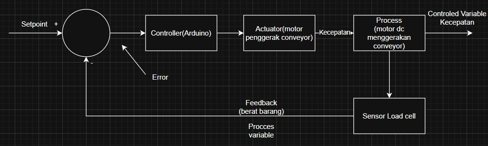
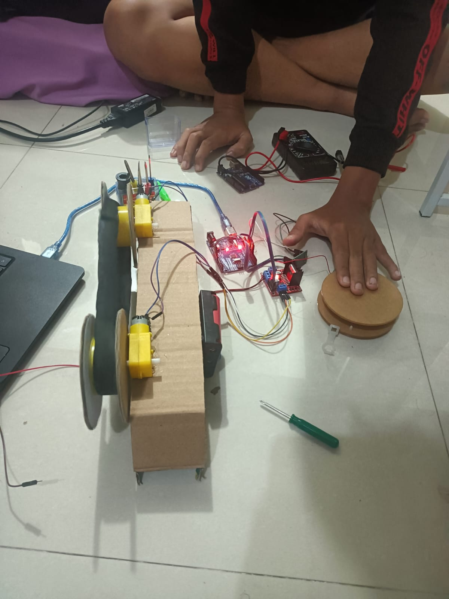

# PID-Based Mini Conveyor Speed Control System

## Overview
This project implements a PID-based closed-loop conveyor control system using Arduino Uno to regulate conveyor speed dynamically based on load conditions. The system uses real-time feedback from a load cell sensor to maintain stable material flow and improve operational reliability.

---

## Features
- Closed-loop PID control system
- Real-time load monitoring
- PWM-based DC motor speed control
- Sensor feedback using HX711 load cell module
- System testing and performance evaluation

---

## Hardware Components
- Arduino Uno
- HX711 Load Cell Amplifier
- Load Cell Sensor
- L298N Motor Driver
- DC Gearbox Motor
- Conveyor Prototype

---

## Software & Technologies
- Embedded C / Arduino
- PID Control
- PWM Signal Control
- Signal Filtering
- Arduino IDE

---

## System Architecture

### Block Diagram

---

## System Workflow
1. Load cell measures conveyor load conditions.
2. Sensor data is processed through HX711.
3. PID controller calculates system error relative to the setpoint.
4. PWM signal is adjusted dynamically.
5. Motor speed changes to maintain stable conveyor operation.

---

## Testing & Evaluation
The system was tested under varying load conditions to evaluate:
- Rise Time
- Settling Time
- Steady-State Error
- Sensor Stability
- Mechanical Reliability

PID tuning was performed using the trial-and-error method to improve system responsiveness and operational stability.

---

## Challenges & Solutions

| Challenges | Solutions |
|---|---|
| Sensor noise instability | Applied averaging/filtering |
| Mechanical vibration | Improved structural stability |
| PWM instability | Optimized PID parameters |

---

## Results
- Successfully maintained conveyor speed stability under varying load conditions.
- Improved system reliability through PID tuning and signal filtering.
- Achieved adaptive motor control using real-time sensor feedback.

---

## Documentation
Project report available in:
[Project Report](docs/PID_conveyor_project_report.pdf)

---

## Testing Media

### Testing Setup

### Testing Video
[Testing Video](images/conveyor_demo.mp4)
---

## Future Improvements
- Implement Kalman Filter for better sensor accuracy
- Add IoT monitoring system
- Improve mechanical frame rigidity
- Use higher precision motor encoder

---

## Author
Muhammad Hafidz Abdurrahman